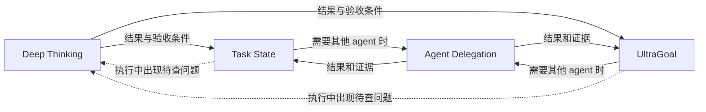

# 四个 Skill 的现状与优化方向

核对日期：2026-09-08。范围：Deep Thinking、Task State With Files、Agent Delegation、UltraGoal，以及它们在总 marketplace 的分发状态。Agent Harness 不在本次产品审查范围内。

本轮是调研和审查，所有优化均为建议。没有修改四个产品的源码、hook 配置或安装状态，也没有提交、推送、发布或迁移既有文档。

**核心判断：保留四个独立模块；先补清楚的交接约定、任务选择和组合验证。UltraGoal 应集中做好目标契约、完成判断和宿主执行衔接。业务文档可以统一入口，运行控制文件不应因目录整齐而整体搬迁。**

## 1. 当前现状

### 1.1 源码能力与总 marketplace 分发存在差距

五个仓库的本地 HEAD 均已用 `git ls-remote origin refs/heads/main` 核对，与各自远程 main 一致。UltraGoal 原有未跟踪研究文件已保留。

| Skill | 关联源码版本 / HEAD | 总 marketplace 固定版本 | 已有核心能力 |
| --- | --- | --- | --- |
| Deep Thinking | 0.1.2 / `13c4776` | 0.1.1 | 澄清与研究往返、竞争解释、独立挑战、过程稿和独立结果 |
| Task State With Files | 0.3.0 / `c4a6061` | 0.2.1 | 持久化理解、判断与证据；命名任务；完整读取；宿主恢复适配 |
| Agent Delegation | 0.4.0 / `28d3c2b` | 0.2.1 | 异步任务 ID、会话续接、结果 JSON、收据、取消和未知结果区分 |
| UltraGoal | 2.15.7 / `a2575a3` | 2.15.6 | 冻结目标条款、验收映射、独立审查凭据、完成检查、所属会话恢复 |

总 marketplace HEAD 为 `dbaa240`。表中的“落后”仅指总 marketplace 的固定版本，不代表源码未发布、单独 marketplace 未更新，或本机实际安装的一定是旧版。本轮没有重新验证每个宿主的安装与信任状态。[固定版本清单](https://github.com/rocky2431/Excellent-skill-Marketplace/blob/dbaa24010a0aa649f92a223141054e1c06188b4a/sources.json)

固定旧版本本身可以是合理的发布选择。需要补的是清楚显示选择了哪个版本、对应能力和兼容证据，而非要求所有 pin 永远等于移动中的 main。

### 1.2 四者已有独立边界，但接力约定还不完整

**Thinking 与 Research 已经在 Deep Thinking 中结合。** 当前流程是 Frame → Clarify ↔ Research → Synthesize → Check → Deliver，并非还需另建一个研究模块。现有 `RESULT.md` 要求有证据、条件、异议和可观察的下一步，但没有为行动型交付统一规定可直接继承的验收条款。[Deep Thinking 工作流与产物](https://github.com/rocky2431/deepthink-skill/blob/13c477679f5664e03b5c016e93d4d5f92e3a5050/plugins/deep-thinking/skills/deep-thinking/SKILL.md#L30-L88)、[结果模板](https://github.com/rocky2431/deepthink-skill/blob/13c477679f5664e03b5c016e93d4d5f92e3a5050/plugins/deep-thinking/skills/deep-thinking/assets/result-template.md)

**Task State 已覆盖“理解持续存在”的大部分基本要求。** 它保存目标、事实与假设、判断修订、证据、未完成工作和下一步；支持命名记录、显式路径、根目录选择、多任务歧义处理和完整读取。它提供恢复支持；执行、调度和继续运行仍由宿主与当前任务承担。[Task State 主说明](https://github.com/rocky2431/plan-with-flie-skill/blob/c4a60617fdcc8be3ec21ee96d0717079ae979dae/plugins/task-state-with-files/skills/task-state-with-files/SKILL.md#L15-L139)

**Send 的连接和格式化回传已有实物。** `submit` 返回 `delegation_id`，`wait/status` 观察同一个任务；收据包含 `status`、`stop_reason`、正文、内容块和运行身份。`success` 的定义是原生模型回合正常结束，不能直接解释为业务验收通过。本次 Claude Code 两轮讨论也使用这条链路。[派发接口](https://github.com/rocky2431/agent-delegate-skill/blob/28d3c2b54a089b8f6db9d4f35898043cb66765cc/plugins/agent-delegation/skills/agent-delegation/SKILL.md)、[状态判定](https://github.com/rocky2431/agent-delegate-skill/blob/28d3c2b54a089b8f6db9d4f35898043cb66765cc/plugins/agent-delegation/skills/agent-delegation/scripts/agent_delegate.py#L341-L361)

**UltraGoal 具有额外的独立职责。** 它并不只是 Thinking + Task + Send 的总和：目标条款、验收证据、完成主张、审查独立性和宿主续跑条件是它自己的核心。当前说明明确要求不假设其他 skill 已安装，也允许原生 worker；它没有新增一个 Agent Runtime。[独立性与职责](https://github.com/rocky2431/ultra-goal-skill/blob/a2575a384d90436411c34c4bd11a2a56fea3cf21/plugins/ultra-goal/skills/ultragoal/SKILL.md#L13-L28)、[执行与续跑边界](https://github.com/rocky2431/ultra-goal-skill/blob/a2575a384d90436411c34c4bd11a2a56fea3cf21/plugins/ultra-goal/skills/ultragoal/SKILL.md#L348-L389)

因此，现状应表述为：**可以由 agent 用文件和任务说明把四者接起来，但缺少稳定、一致的接力约定与真实组合验收。** 没有跨仓库 import 不是缺陷，也不能据此认定“零组合”。“任意组合”的实用含义是可以省略、替换、分支和返回，同时满足下一步所需输入。

### 1.3 Hook 不是普遍失控，但 Task 的隐式恢复需要调整

本轮直接运行当前脚本，在临时目录中构造输入，结果保存在同目录 `hook-probes.json`。这些是脚本行为验证，不等于四个原生宿主全生命周期验收。

| 情况 | 当前观察 | 判断 |
| --- | --- | --- |
| 没有任务文件、没有 active goal | Task 四个适配脚本及 Ultra 七个脚本均 exit 0，stdout/stderr 为空 | “无目标不介入”已有实现 |
| 同一目录只有 `.tasks/a.md`，事件来自无关会话 B，未选择任务 | Task 四个适配脚本均注入 A 的内容 | 文件存在并不能表示当前会话正在用该 skill |
| Task 显式 `TASK_STATE_DISABLED=1` | 四个适配脚本均静默 | 已有单次关闭能力 |
| 多个 Task 记录，未选任务 | 返回歧义提示，不擅自选择 | 避免选错已有保护；仍会向未选择任务的会话输出内容 |
| Ultra active marker 绑定会话 A，事件来自 B | 七个脚本均静默，临时工作区文件哈希不变 | 所属会话隔离已经成立 |
| 同一 SessionStart 的两份记录故意写入相反下一步 | Ultra 输出“执行 migration”，Task 输出“已回滚，不要重跑”，两者均注入 | 当前没有跨模块的工作状态仲裁 |

Task 的恢复入口读取 cwd、root 和 task 选择器，未使用 `session_id`；其唯一记录自动选择是当前明确实现的行为。因此这是与本次更严格的即插即拔需求之间的差距，而不是声称旧实现违反了自己的原定契约。[Task 发现与选择](https://github.com/rocky2431/plan-with-flie-skill/blob/c4a60617fdcc8be3ec21ee96d0717079ae979dae/plugins/task-state-with-files/skills/task-state-with-files/scripts/task_state_runtime.py#L118-L253)、[Ultra 所属会话检查](https://github.com/rocky2431/ultra-goal-skill/blob/a2575a384d90436411c34c4bd11a2a56fea3cf21/plugins/ultra-goal/skills/ultragoal/scripts/goal_hooks.py#L341-L435)

共注入案例由 Claude 在第二轮提出，主审又用相同输入事件复现；两侧分别输出 811 和 888 字符。这是构造冲突输入后观测到的缺少仲裁，不是声称用户真实任务已经错误执行了 migration；探针没有执行任何业务操作。

这里也应避免两个过度承诺：全局 hook 静默不代表没有启动脚本的成本；skill 内的 hook 也不能完全替代启动恢复 hook，因为新会话的 SessionStart 可能早于 skill 调用。Claude 当前文档区分插件级 hook 和调用 skill 后在该会话持续存在的 hook，但不能把这个宿主能力直接当成四端共同契约。[Claude Hook 作用域](https://code.claude.com/docs/en/hooks#hook-locations)

### 1.4 Ultra 与 Send 有一个已复现的观测覆盖缺口

Ultra 的 `delegation_target()` 能识别直接的 `agent-delegate run --to ...`，不能识别当前主路径的 `submit`、`wait`，也不能识别 `rtk proxy agent-delegate run ...`。因此，部分当前派发调用不会进入该 hook 的 `role_unavailable/role_recovered` 观测。[检测实现](https://github.com/rocky2431/ultra-goal-skill/blob/a2575a384d90436411c34c4bd11a2a56fea3cf21/plugins/ultra-goal/skills/ultragoal/scripts/goal_tool_failure.py#L37-L77)

这是观测覆盖问题。**本轮没有证明派发本身失败，也没有证明缺失的必要审查能通过完成检查。** Ultra 当前文档明确说派发失败/恢复事件不直接决定完成，完成仍由当前输出和必要审查证据决定。[失败观测与完成判断的分工](https://github.com/rocky2431/ultra-goal-skill/blob/a2575a384d90436411c34c4bd11a2a56fea3cf21/plugins/ultra-goal/skills/ultragoal/references/agent-modes.md#L272-L308)

第二轮 Claude 直接检查了 `check_review`：必要回执缺失、回执来自目标所属会话，两种情况均拒绝。主审核对了相应检查实现。[必要审查检查](https://github.com/rocky2431/ultra-goal-skill/blob/a2575a384d90436411c34c4bd11a2a56fea3cf21/plugins/ultra-goal/skills/ultragoal/scripts/goal_contract.py#L138-L198)

## 2. 公开实践中值得借鉴的部分

以下是一手规范、源码和作者复盘的定向比较，并非全市场排名。网页于本轮读取；三个开源组合案例还核对了当前 HEAD。

| 实践 | 可借鉴的具体做法 | 本项目需要保留的区别 |
| --- | --- | --- |
| [Agent Skills 规范](https://agentskills.io/specification) | metadata、主说明、资源分层加载；脚本自包含或明确依赖 | 规范解决 skill 包和加载方式，未替我们定义业务交接、任务选择与验收语义 |
| [Anthropic 上下文工程，2025-09](https://www.anthropic.com/engineering/effective-context-engineering-for-ai-agents) | 按需要读取内容；结构化笔记；工具职责少重叠 | 不把所有历史、所有模块的工作状态都常驻注入 |
| [Anthropic 长任务复盘，2026-03](https://www.anthropic.com/engineering/harness-design-long-running-apps) | 用文件连接规划、实现和评估；执行前明确可检验结果 | 作者后来随模型改善去掉 sprint 等结构；应逐项验证其价值，不能复制整套循环并承诺通用收益 |
| [Superpowers writing-plans](https://github.com/obra/superpowers/blob/b36e0829c6d0140e93cfef2ca599b1b07d4a7797/skills/writing-plans/SKILL.md) | 计划明确引用原 spec，保留跨任务约束，文档路径服从项目/用户约定 | 它的流程强绑定，以及 [启动 hook 全局注入](https://github.com/obra/superpowers/blob/b36e0829c6d0140e93cfef2ca599b1b07d4a7797/hooks/session-start)，不适合照搬到本次更强的可拔插要求 |
| [OpenSpec concepts](https://github.com/Fission-AI/OpenSpec/blob/e062b9572be933564ba3899d059377dfa1393e32/docs/concepts.md) | 区分当前规格与变更；用行为及场景表达验收；按需要增加严谨度 | 借鉴文档职责划分，不必引入它的完整 schema/依赖图系统 |
| [Spec Kit](https://github.com/github/spec-kit/blob/4a7341a93d944d6efe153b71da4a1adb9c2b578c/README.md) | 区分核心、扩展、模板变体与组合分发 | 可以提供组合示例或合集，不必把独立能力合并成共同运行时 |
| [ACP prompt-turn](https://agentclientprotocol.com/protocol/v1/prompt-turn) | 会话、更新流、结束原因与取消确认是清楚的通信边界 | 协议回合结束与业务目标完成必须分开 |

综合这些来源，我的判断是：**最值得统一的是可理解的输入、产物引用和结果解释；目录树或强制执行顺序不能代替这些约定。** 这是面向本项目的推论，不是某份规范已经规定的答案。

## 3. 具体优化方向

下面的箭头代表按任务需要选择的交接；各模块均保留独立入口。



### 3.1 给行动型 Thinking 产物加一个短交接段

保留 `THOUGHTS.md` 和 `RESULT.md`，无需普遍增加第三份规格文档。若结果将进入执行，在结果中写清：

- 要达成的结果，以及明确不做的事情。
- 验收条款：稳定 ID、可观察行为、判断条件和对应证据；必要时注明独立检查者。
- 已确认约束与仍待决定的事项，区分用户要求和 agent 建议。
- 必须读取的源文档、实际工作区、关键版本/未提交产物，以及最有用的下一步。

已有验收 ID 应原样传递；进入 Ultra 时使用其现有 Acceptance 与 `covers` 约定，不再建立第二套编号系统。检查交接既要对比 ID，也要对比要求正文、边界和证据条件。相同 ID 下把“必须保留”改成“可以删除”，ID 集合仍然相等；上游 `RESULT.md` 与下游 goal 结构不同，也不能要求两份文档的整体哈希相等。形成具体 goal 并确认后，才使用其既有冻结检查。[Ultra 现有映射检查](https://github.com/rocky2431/ultra-goal-skill/blob/a2575a384d90436411c34c4bd11a2a56fea3cf21/plugins/ultra-goal/skills/ultragoal/scripts/goal_contract.py#L22-L68)

详细程度以接收方能够继续正确工作为准，不以篇幅、字段数或预写多少代码为准。研究型结论可用来源可核对、反证已处理、适用条件清楚作为交付标准；不必伪装成可运行的软件测试。

下游优先继承已确定的内容，再补自己的执行条件。**上游已交付，不等于用户已接受该方案或授权开始执行。** Ultra 仍需具体的最终目标包与相应授权，优化的是重复采访和重复转写，而不是取消真实的用户决定。

### 3.2 Task 先解决选对任务，再强化完整恢复

新的正常恢复路径建议以显式 task/root/file 选择及当前会话绑定为准。复用已有选择器；无选择时不自动接管唯一状态文件。保留旧发现行为应作为明确的兼容选择，或只用于主动 `read`，不能让旧文件无声介入无关任务。

代价是新会话需要明确恢复哪个任务。接力方应该把记录路径、工作区和下一步一同传入，由 agent 使用它们完成选择；不必每次重新询问用户，也不必新增通用工作流引擎。宿主无法可靠保留选择时，明确使用完整读取作为恢复方式。

恢复验收关注接收方的实际行为：它是否继承关键纠正、避免已排除的路径、找到未完成工作并执行正确下一步。文件存在、输出长度足够、`read` 退出 0 都不能单独证明这些。

### 3.3 为同一任务指定一个当前工作状态的写入者

建议明确四种文档职责：

| 内容 | 谁负责 | 其他模块如何使用 |
| --- | --- | --- |
| 研究问题、证据与判断变化 | Thinking 的工作稿 | 直接引用和读取，不另抄一个研究进度本 |
| 当前执行理解、步骤和下一步 | 选定的 Task 记录，或简单目标的 Ultra Carry-over | 一处维护主体；另一处只保留必要的运行摘要及定位信息 |
| 已接受的目标条款与完成依据 | Ultra goal contract（使用 Ultra 时） | 从已确认输入形成版本明确的契约；执行期间不能静默降低标准 |
| 调用事件、原始结果与审查凭据 | 对应的运行工具/检查者 | 工作状态链接证据；摘要不能取代唯一原始来源 |

Task 已允许读取/绑定已有业务文档，可复用这种能力。组合时不要机械要求 Thinking、Task 和 Ultra 各写一份相同的“现状/下一步”。同样，不要建立第二份全局 active 指针去协调本来独立的会话。

已有 `work/task-state.ref` 是共享路径绑定，并非会话私有选择；并发任务不能靠来回改它选任务。优先传入具体任务/文件和根目录，保留一名主体记录写入者。

### 3.4 Send 保持传输职责，结果解释接到真实消费者

优先在现有任务记录中保存 `delegation_id`、结果收据及实际产物引用。交接包括已失败的尝试、已知事实和已有授权；接收方读取并检查关键证据。

必须区分：观察等待结束、执行结束、结果未知、业务检查失败、业务检查通过。观察超时继续看同一个 ID；执行结果未知时先核对实际副作用，不能直接重复派发相同工作。

Ultra 的短期改进是明确覆盖边界并沿真实任务结果取证。若确有自动审计消费者，再增加一个只读现有版本化收据的窄适配；避免为 `rtk`、shell 包装、复合命令不断扩展字符串猜测。工具层的 `success` 不应被改名成任务“验收通过”。

应把“当前主推的异步路径不在这段 hook 自动观测范围内”写得显眼，明确由调用方保留和核对终态收据。现有文档所写的直接 `run` 与当前检测实现相符；在代码没有支持异步结果前，仅把文档中的 `run` 改成 `submit` 会制造错误承诺。

### 3.5 Ultra 做清楚的目标执行入口，并保留独立使用能力

优先精进四点：

1. **接收已存在的结果/规格。** 先读来源和已经确定的条款，只补缺失的验收、资源、执行与证据条件。
2. **区分工作状态与目标条款。** 当前方法可以调整，已接受的目标不会随任务失败被悄悄改写。
3. **展示真实执行模式。** 原生持续执行、交互中继续、仅完成检查，应按实际宿主能力分别陈述。
4. **保留必要的独立检查。** 多轮讨论不自动提高可信度；缺失的必要审查不能由实现者自评填补，也不能用传输回合成功代替。

它可以使用 Thinking、Task 和 Send，也应继续在它们未安装时完成一个普通目标的必要准备与检查。避免从“有可选复用”演变成“必须先装齐四个”。

独立使用时保留必要的澄清、Carry-over 和 worker 说明；组合使用时优先读取既有产物，不重复重建。哪些属于独立使用所必需，哪些可从其他模块复用，应在说明中明确。

## 4. 文档要不要统一到 documents？

**支持统一业务文档的查找方式和项目约定，暂不支持把所有运行文件迁到一个总目录。** 已有 `docs/` 的项目继续使用 `docs/`；已有 `documents/` 的项目沿用它。没有约定的新项目，可以默认采用 `documents/<work-id>/`。

定位顺序应写清：本次明确指定的路径 → 同一任务已存在的文档 → 仓库既有业务文档约定 → 新项目默认位置。两个目录同时存在不必自动报错或重新采访用户；先检查它们的实际职责和既有约定。接力直接传递确定路径，比让每个模块自行扫描、再猜一次目录更可靠。

例如，尚无约定的新项目可以形成以下按需布局：

```text
documents/<work-id>/
  THOUGHTS.md       # 存在研究过程时
  RESULT.md         # 存在独立交付物时
  evidence/         # 存在必须保留的业务证据时

.tasks/<work-id>.md # 使用 Task 且没有可复用记录时
.goals/<slug>.*    # 使用 Ultra 时保留现有契约、marker、基线与事件
```

图中的文件不会每次全部创建。已有正式 spec、计划或工作记录就引用它；私人派发收据继续保留在既定目录，当前记录指向所需收据即可。尚未授权复制或公开的来源不因建立文档目录而迁入 Git。

这不是最终的全局目录迁移方案。它先满足“人能找到交付物、agent 能找到当前任务”，保留现有解析器和在途任务的有效路径。如果实际接力证明某个业务记录需要迁入统一目录，再对该路径做兼容迁移。仅增加一层 `documents/` 而不解决谁写、何时归档、以哪份为准，混乱仍会存在。

## 5. 建议顺序及验收

**先做一条能完整使用的接力，再扩展。** 建议第一条是 Thinking → Task → 新 Claude Code 会话接续；它直接覆盖已有研究、持久化和跨 agent 使用，同时无需提前依赖 Ultra。

| 顺序 | 工作 | 足够有意义的验收 |
| --- | --- | --- |
| 1 | 写清四模块职责、行动型交接段和 Task 激活语义 | 四个仍可单装；全装但未使用时不注入任务内容、不改工作区、不执行业务工具 |
| 2 | 实跑 Thinking → Task → 新会话 | 接收方保留同一目标/验收、关键纠正和原始证据，正确完成一个未完成步骤；不是仅打印文件 |
| 3 | 实跑 Thinking → Ultra | 继承原验收 ID 和约束；仅补缺失执行条件；不把已交付当授权；运行中不降低标准 |
| 4 | 实跑失败任务 → Send → 恢复 | 观察超时不重发；原任务 ID 的终态与产物能定位；结果未知不被写成成功；不得重复已发生的效果 |
| 5 | 验证同目录多任务，以及 Task + Ultra 共同恢复 | 会话 A 不消费 B 的状态；无互相矛盾的当前下一步；只有指定写入者更新主体记录 |
| 6 | 明确选定版本并更新分发 | 目录/包/版本均匹配选定 SHA，并以目标宿主新会话验证；另列源码已有更新，不要求 pin 永追 HEAD |

以上是优化实施时的验收建议，本轮未执行整套组合矩阵。各宿主适配应逐一保留实际结果和局限，不能用某一宿主的脚本 JSON 测试替代全部宿主验收。

已有 `scripts/catalog.py refresh` 会改写 pin、目录与包，不能当作只读漂移检查直接运行。漂移报告先比较选定版本与已存在的源版本；正式刷新仍是一次单独的发布操作。本轮未执行 refresh。

不建议现在引入：统一数据库、公共状态机、强制 skill 链、通用事件总线、全项目目录迁移，或仅为了增加测试数而给纯提示词 skill 增加框架。

## 6. 审查与验证说明

本次由 Codex 主审，Claude Code 进行两轮真实讨论：第一轮独立核对源码与证据，第二轮针对候选方案和异议复查。具体结论以检查对象和证据为准，不以两个 agent 一致为验收。

| 轮次 | 内容 | 实际返回 |
| --- | --- | --- |
| 第一轮 | 独立源码审查、hook 探针、问题与反对意见 | `5fdf54b6e5254762b1916585f4900404`；`success / end_turn` |
| 第二轮 | 复核候选及主审异议，测试必要审查与双状态注入 | `a9789600b2fd42ecaa877a13a14613a1`；`success / end_turn` |

两轮实际使用同一 Claude 原生会话 `2b5b827f-c1b2-4e32-ba68-791b9c1ebbd3`，实现了上下文续接；运行收据记载 CLI 为 Claude Code 2.1.263、ACP adapter 0.75.1。保留目标默认模型配置，未据此声称使用了哪个具体模型。[第一轮原始回执](/Users/rocky243/.local/state/agent-delegation/runs/20260908T023855Z-5fdf54b6e5254762b1916585f4900404/result.json)、[第二轮原始回执](/Users/rocky243/.local/state/agent-delegation/runs/20260908T025118Z-a9789600b2fd42ecaa877a13a14613a1/result.json)

第一轮若干建议已被主审收窄：无代码调用不等于没有可组合性；旧 marketplace pin 不等于源码未发布；派发观测缺失不等于必要审查被绕过；`read/status` 成功不等于语义接力成功；纯提示词的包检查不必为适配 pytest 改造。

第二轮也没有直接照收所有建议：ID 集合相等不能证明条款含义相同；上游研究文档和下游目标包不适合比较整体冻结哈希；两个文档目录共存不应机械触发新的确认流程。Claude 坚持尽快订正派发覆盖说明；主审采纳显著补充异步路径限制，但保留“现有直接 run 描述与代码一致”的判断。

主审当前源码验证：

```text
UltraGoal: 20 项激活、会话归属和无目标脚本测试通过。
Task State: 39 项生命周期、SessionStart 和记录恢复测试通过。
临时脚本探针: 无目标、无关会话、显式关闭、歧义记录、派发命令识别。
```

可复核命令：在 UltraGoal 的 `tests` 目录运行 `python3 -m unittest test_goal_hooks.ActivationTests test_goal_hooks.SessionOwnershipTests test_goal_hooks.ScriptSmokeTests.test_every_script_exits_zero_and_is_silent_without_a_loop -v`；在 Task State 的 `tests` 目录运行 `python3 -m unittest test_lifecycle_hook test_session_start_hook test_task_state_runtime -q`。本轮均用 `PYTHONDONTWRITEBYTECODE=1`。

Claude 第一轮另做了全量测试；它报告 UltraGoal 的包卫生检查在现有 `work/ultragoal-native-install/` 本机回执上失败。主审没有在干净发布快照重跑该全量套件，因此这里不宣布产品全量全绿，也不把这一观察当作新产品缺陷的根因结论。

本轮证据没有建立四端无人值守业务闭环、所有组合的可靠性比例，或真实故障后的端到端恢复率。后续应围绕上表的实际场景补证据。
